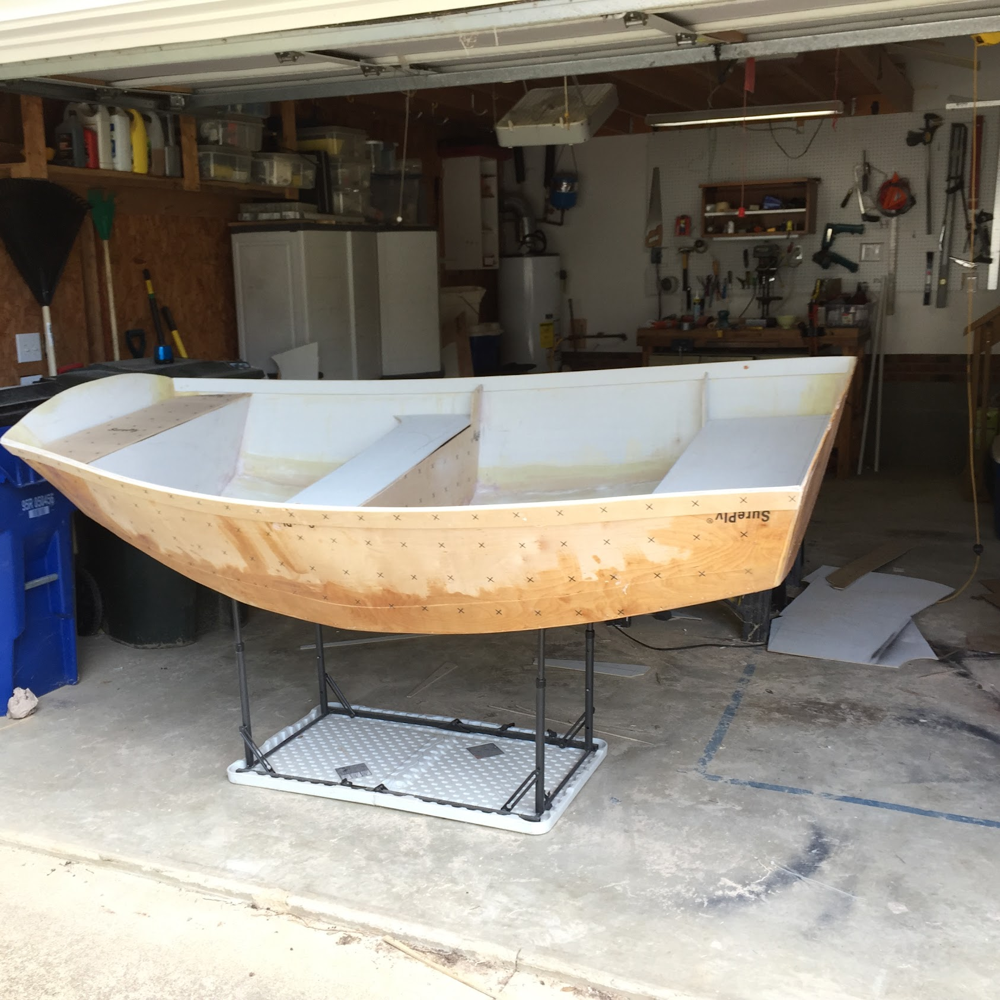

[Chuck's Bio](./bio.html)

There should be whitespace between paragraphs.

There should be whitespace between paragraphs. We recommend including a README, or a file with information about your project.

# simple ios change 2

### Gooseberry Falls Sasha's Snake

### Old DIY Dinghy 

