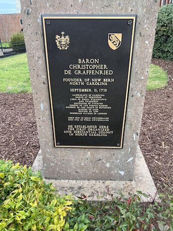

[Chuck's Bio](./bio.html)

# Photo Albums of Family and Trips

### Bears in New Bern NC

Selfies with the Bearsome random pictures of our new place in New Bern, NC.  There are a lot of bears around town, so it will take a while to capture them all

 

### New House in New Bern NC

Some random pictures of our new place in New Bern, NC.

 

### March 2022 - New Bern NC

Spent time on New Bern to work on the boat, enjoy the town and spend time with Sasha and Wendi's parents who took their RV down.  It was a cute house, and working remote went well

 

### Feb 2022 - Charlston SC

Heading to Charleston to see if there is a potential to live and sail there.  It is no further from the Ashville area than Durham, NC.  We will also get to see my sister and brother-in-law when there, and will work 1 of the 2 weeks we are in SC.
### March 2022 - New Bern NC

Spent time on New Bern to work on the boat, enjoy the town and spend time with Sasha and Wendi's parents who took their RV down.  It was a cute house, and working remote went well

 

### August 2022 - Richmond VA

Heading to Richmond VA for the weekend and it was amazing.  There was a lot to see at the James River and a ton of museums that we will need to go back to see.  We saw the canals and a Belle Island that was used a prison camp during the civil war.

 

https://photos.app.goo.gl/DDgYeNDfKmQSQZeH6

### Feb 2022 - Charlston SC

Heading to Charleston to see if there is a potential to live and sail there.  It is no further from the Ashville area than Durham, NC.  We will also get to see my sister and brother-in-law when there, and will work 1 of the 2 weeks we are in SC.

 

### December 2021 - New Bern Floatilla

We stayed with Mark and Tiffini and "crewed" their very nice 34' sailboat out of New Bern and took part in the holiday floatilla. 

 

### October 2021 - Annapolis Boat Show

We are heading to the annual boat show, looking for life jackets and to look at some pretty boats

 

### October 2021 - Hendersonville

We had a quick overnight visit to Sasha.  We visited a couple of parks, a sunflower field with 20 varieties.  We ate at a great food truck and just had a great visit.

 

### October 2021 - Holden Beach

 

### Sept 2021 - Gooseberry

 

### Dec 2020 - Early Days and Moving  Serenity

 

### California 2019

 

### Us 

 

### Family

 

### Wendi

### Chuck

### Sahsa

### Ezrie

### Harris

### Percy

### Other Pets

### Older Pictures

 

### Amsterdam and Paris 

 

### Disney

### Ireland

### New Zealand 

### NYC

### DIY Dinghy 

 

